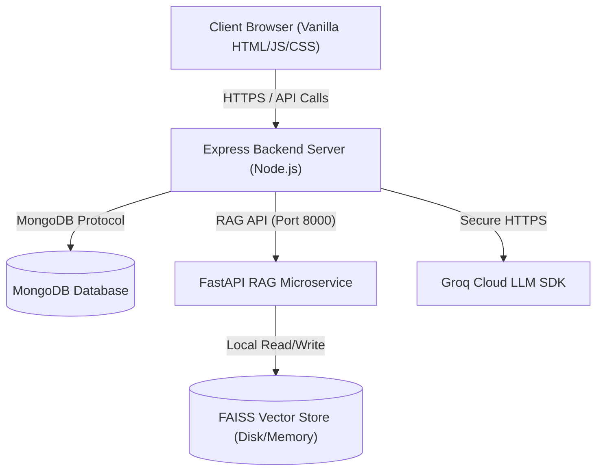
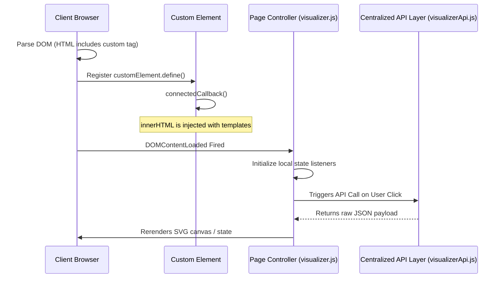

# CodeMind AI — System Architecture

This document describes the production-ready modular architecture of the CodeMind AI DSA learning platform. It details the directory layout, the web components architecture, routing separation, LLM integration, and the FastAPI RAG microservice.

---

## 1. System Topology

CodeMind AI is structured as a decoupled two-tier client-server application with an auxiliary FastAPI RAG microservice.



---

## 2. Directory Layout

The codebase has been reorganized to isolate responsibilities:

```
codemind-ai/
├── frontend/
│   ├── pages/                   # Clean HTML views
│   │   ├── index.html           # Landing / Marketing Page
│   │   ├── login.html           # User Authentication Page
│   │   ├── chatbot.html         # AI Chat & Practice Dashboard
│   │   └── visualizer.html      # Universal Code Visualizer
│   │
│   ├── components/              # Reusable browser Custom Elements (No Shadow DOM)
│   │   ├── navbar/              # Landing header navbar
│   │   ├── footer/              # Marketing footer
│   │   ├── sidebar/             # Workspace panel sidebar
│   │   ├── topbar/              # Workspace header topbar
│   │   └── visualizer/          # Visualizer panels & bottom controls
│   │
│   ├── css/                     # Harmonized stylesheets
│   │   ├── main.css             # Base styles & landing theme
│   │   ├── auth.css             # Login card & input states
│   │   ├── dashboard.css        # Workspace layout grids
│   │   ├── chatbot.css          # Message bubbles & roads
│   │   └── visualizer.css       # Canvas, panels, and slider controls
│   │
│   ├── js/                      # Modular script files
│   │   ├── api/                 # Centralized API service layer
│   │   │   ├── authApi.js       # Register / Login / Logout
│   │   │   ├── chatbotApi.js    # Send messages, index files, document lists
│   │   │   ├── visualizerApi.js # Ast analyze, flow graphs, dry runs
│   │   │   └── premiumApi.js    # Premium purchase check skeletons
│   │   │
│   │   ├── auth/                # Login form & tab interaction
│   │   ├── chatbot/             # SSE Chat streams, roadmap toggle, markdown rendering
│   │   ├── visualizer/          # AST parsing, SVG tracer, step execution controls
│   │   └── dashboard/           # Dashboard loading lifecycle scripts
│   │
│   └── assets/                  # Shared assets
│       └── images/              # logo.png, favicon.png
│
├── backend/
│   ├── src/
│   │   ├── config/              # MongoDB connection setup
│   │   ├── controllers/         # Standalone request handlers (separated from routes)
│   │   │   ├── authController.js
│   │   │   ├── chatController.js
│   │   │   ├── executeController.js
│   │   │   ├── flowController.js
│   │   │   ├── complexityController.js
│   │   │   ├── uploadController.js
│   │   │   └── analyzeController.js
│   │   │
│   │   ├── middleware/          # Authorization & security headers (Helmet)
│   │   ├── routes/              # Thin endpoint mapping definitions
│   │   ├── models/              # Mongoose user schema
│   │   ├── services/            # Pure business engines (sandboxing, Groq, RAG client)
│   │   ├── app.js               # Express app middleware and static setup
│   │   └── server.js            # Port bindings and initialization entry point
│   │
├── rag_service/                 # FastAPI RAG service
│   ├── embeddings/              # Sentence-transformers (384-dimension MiniLM)
│   ├── vectorstore/             # FAISS file-based index adapter
│   ├── retrievers/              # Text chunker & search pipelines
│   └── app.py                   # FastAPI microservice endpoints
```

---

## 3. Frontend Architecture

### Custom Elements (No Shadow DOM)
Reusable UI elements are implemented as native browser **Custom Elements** (without Shadow DOM) to allow global stylesheets (`main.css`, `dashboard.css`) to style them natively.



### Global Event Bindings
To maintain backward compatibility with inline markup event handlers (e.g. `onclick="runAnalysis()"`), functions invoked by Custom Element elements are registered globally on the `window` object (e.g., `window.runAnalysis = runAnalysis`).

---

## 4. Backend Routing & Controllers

Route files in `backend/src/routes/` are thin mappings that delegate business requests directly to handlers in `backend/src/controllers/`.


- **Security Checks**: The code execution controller leverages `executeService` to check submitted snippets against dangerous functions, imports, and system processes (`process`, `require`, `os`, `sys`, `subprocess`, etc.) before spawning processes.

---

## 5. RAG Pipeline & Vector Store

The Python FastAPI microservice manages document indexing and semantic retrieval.

```mermaid
graph TD
    Upload["Upload File (.pdf / .txt)"] --> App["app.py /index/file"]
    App --> Chunker["chunk_text() (retrievers/chunker.js)"]
    Note over Chunker: Splits into ~500 char chunks with overlap
    Chunker --> Embedder["Embedder.embed() (embeddings/embedder.py)"]
    Note over Embedder: SentenceTransformer (all-MiniLM-L6-v2)
    Embedder --> FAISS["FAISSVectorStore.add() (vectorstore/vectorstore.py)"]
    FAISS --> Disk["Disk Persistence (faiss_store/)"]
```

- **Lifespan Loader**: The service leverages FastAPI's `lifespan` context manager to auto-index documents in the `docs/` folder on startup.
- **Search Mechanics**: Query strings are encoded into 384-dimensional normalized float vectors. A cosine-similarity lookup is executed against the FAISS `IndexFlatIP` database to fetch the top-k chunks.
